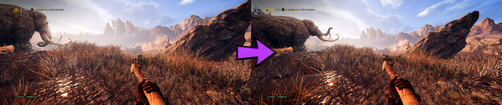

## Far Cry Primal ultrawide and wider
The solution for ultrawide and wider aspect ratios addresses the issue of the vertical field of view reduction manifesting at higher FOV settings and very wide resolutions. It removes the limitation from the cutscenes and the gameplay.

1. [Download the archive](/../../releases).
2. Unpack the files to the \bin\ folder inside the game directory.

Tested on the latest Steam version at 2560x1080, 3840x1080, 5760x1080 and 11520x1080.

You can buy me a [coffee](https://ko-fi.com/rozziroxx) or become a [patron](https://www.patreon.com/rozzi).

